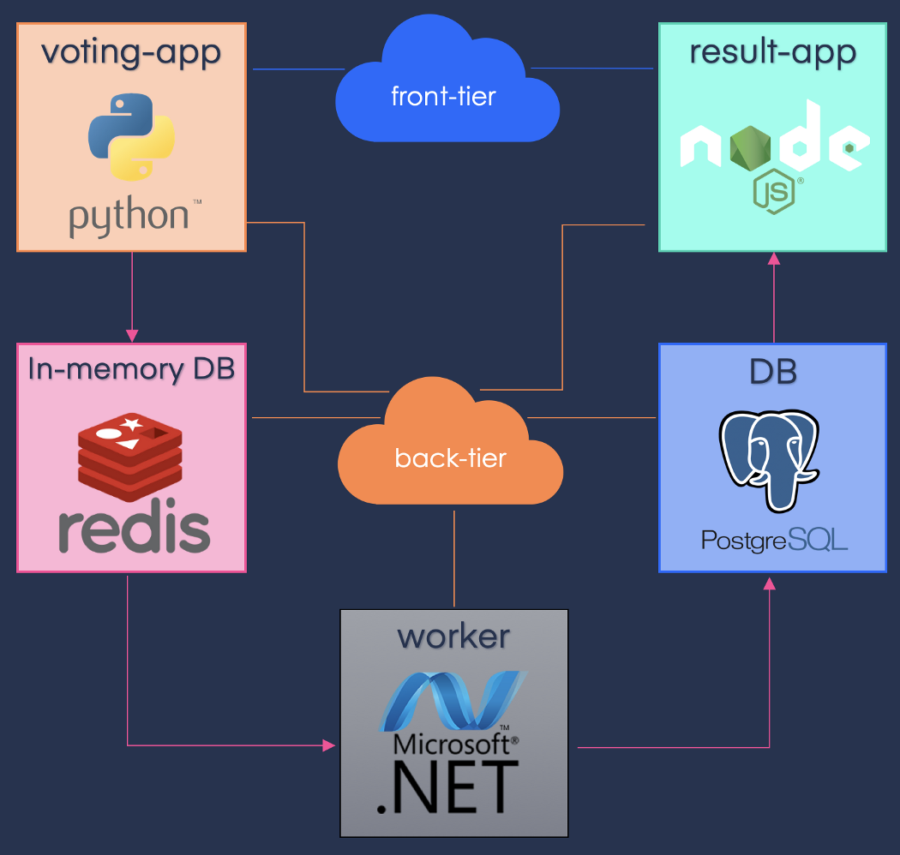

# Example Voting App
> This is a simple application based on micro-services architecture, consisting of 5 simple services

## Working
- Voting-App: Frontend of the application written in Python, used by users to cast their votes.
- Redis: In-memory database, used as intermediate storage.
- Worker: .Net service, used to fetch votes from Redis and store in Postgres database.
- DB: PostgreSQL database, used as database.
- Result-App: Frontend of the application written in Node.js, displays the voting results.

> NOTE: The voting application only accepts one vote per client. It does not register votes if a vote has already been submitted from a client.

## Architecture


## Docker deployments

### .env file
Change the Parameters in the env file with your own docker account username and build tags
```DOCKER_REPO=<your-docker-username>
BUILD_TAG=1.0.0
```
### Building the images
```
$ docker-compose -f docker-compose-build.yml build --no-cache
```
### Deploying the app to docker
```
$ docker-compose up -d
```
### Deploying in docker swarm
```
$ docker stack deploy -c docker-stack.yml vote
```

## Kubernetes deployment

The vote and result are front-end so we need to access them from outside the cluster , so we need a NodPort service for each of them in order to access it from outside the cluster.
for the redis and postgresDB we need an clusterIP service because it's still inside the cluster.
if we look at the source code of the worker we can see that he connect to each database using their services and update the votes from the redis to postgres. so technically no one is accessing the worker so we don't need a service for him.